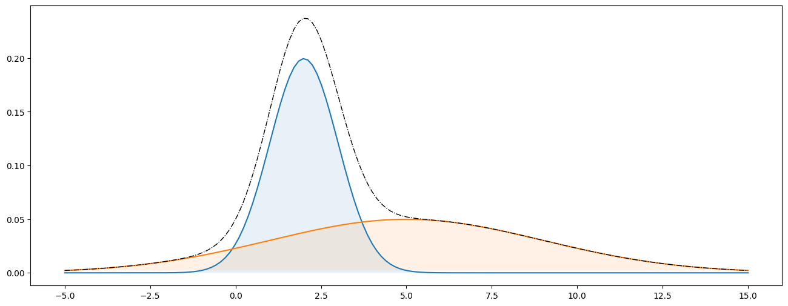
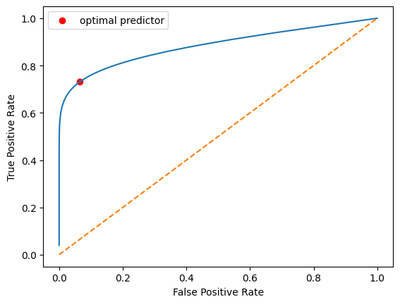

# 1. Predictions with a statistical model

In machine learning, we have a **population** of $N$ instances $(x_i,y_i)_{i=1}^N$ but we first consider the statistical setting (called decision theory) where we know the **distribution** of $(X,Y)$. The question is then: given a sample $x$ from this distribution, what is the best prediction for the associated $y$?

## 1.1 Optimal prediction

**Modeling knowledge** as a probability distribution with a statistical model $p(x,y)$.

Generative model: $p(x|y)$. So that $p(x,y) = p(x|y)p(y)$.

We restrict ourselves to binary prediction, i.e. the target $Y\in \{0,1\}$.

So that the **prior** for $Y$: $p(y)$ in our case: $p_0= \mathbb{P}(Y=0)$ and $p_1=1-p_0$.

We denote by $\hat{y}(X)$ the predictor for input $X\in \mathcal{X}$. For classification, we ask for $\hat{y}:\mathcal{X}\to \{0,1\}$. In our examples, we will take $\mathcal{X} = \mathbb{R}$.

The **loss function** generalizes the natural notion of error: $\text{loss}(\hat{y},y)\in \mathbb{R}$.

Ex: prediction error $\text{loss}(\hat{y},y) = \mathbf{1}(\hat{y}\neq y)$.

!!! info "Definition: Risk"
    The **risk** of a predictor $\hat{y}$ is the expected loss:

    $$R(\hat{y}) = \mathbb{E}[\text{loss}(\hat{y}(X),Y)] = \sum_{x,y} p(x,y) \text{loss}(\hat{y}(x),y).$$

!!! abstract "Lemma: Optimal predictor"
    The predictor minimizing the risk is given by:

    $$\hat{y}(x) = \mathbf{1}\left( p(1|x) \geq \frac{\text{loss}(1,0)-\text{loss}(0,0)}{\text{loss}(0,1)-\text{loss}(1,1)}p(0|x)\right).$$

??? note "Proof"
    Since

    $$R(\hat{y}) =  \sum_{x} p(x) \mathbb{E}\left[ \text{loss}(\hat{y}(x),Y)|X=x\right],$$

    we just need to compare the two terms:

    $$\mathbb{E}\left[ \text{loss}(0,Y)|X=x\right] = \text{loss}(0,0)p(0|x) + \text{loss}(0,1)p(1|x)$$

    $$\mathbb{E}\left[ \text{loss}(1,Y)|X=x\right] = \text{loss}(1,0)p(0|x) + \text{loss}(1,1)p(1|x)$$

!!! tip "Remark"
    In the case where $\text{loss}(0,0)=\text{loss}(1,1)=0$ and $\text{loss}(0,1)=\text{loss}(1,0)=1$, the optimal predictor is given by $\hat{y}(x) = \arg\max_{y\in \{0,1\}} p(y|x)$, which is the maximum a posteriori (MAP) rule.

Since our generative model is typically described with $p(x|y)$, we can rewrite the optimal predictor with Bayes rule (here $p(1|x) = \frac{p(x|1)p_1}{p(x)}$ and $p(0|x) = \frac{p(x|0)p_0}{p(x)}$):

$$\hat{y}(x) = \mathbf{1}\left( \frac{p(x|1)}{p(x|0)} \geq \frac{p_0\left(\text{loss}(1,0)-\text{loss}(0,0)\right)}{p_1\left(\text{loss}(0,1)-\text{loss}(1,1)\right)}\right).$$

!!! info "Definition: Likelihood ratio"
    The likelihood ratio is defined as: $\mathcal{L}(x) = \frac{p(x|1)}{p(x|0)}$ and a likelihood ratio test is a test of the form: $\hat{y}(x) = \mathbf{1}\left( \mathcal{L}(x) \geq \eta \right)$ for some $\eta>0$.

!!! tip "Remark"
    In the case where $\text{loss}(0,0)=\text{loss}(1,1)=0$ and $\text{loss}(0,1)=\text{loss}(1,0)=1$, and $p_0=p_1$, the MAP rule reduces to: $\hat{y}(x) = \mathbf{1}\left( \mathcal{L}(x) \geq 1 \right) = \arg\max_{y\in \{0,1\}} p(x|y)$, which is the maximum likelihood (ML) rule.

## 1.2 Confusion matrix and ROC curve

The confusion matrix is given by:

|          | Y=0              | Y=1              |
|----------|------------------|------------------|
| $\hat{y}=0$ | True negative    | False negative   |
| $\hat{y}=1$ | False positive   | True positive    |

A few definitions:

- **true positive rate (TPR):** $\mathbb{P}(\hat{y}=1|Y=1)$ also called sensitivity or recall.
- **false negative rate (FNR):** $\mathbb{P}(\hat{y}=0|Y=1)=1-\text{TPR}$ also known as type II error.
- **false positive rate (FPR):** $\mathbb{P}(\hat{y}=1|Y=0)$ also known as type I error.
- **true negative rate (TNR):** $\mathbb{P}(\hat{y}=0|Y=0)=1-\text{FPR}$.
- **precision:** $\mathbb{P}(Y=1|\hat{y}=1) = \frac{p_1 \text{TPR}}{p_1\text{TPR} + p_0\text{FPR}}$.
- **$F_1$ score** is the harmonic mean of precision and recall.

Note that, we have

$$\begin{align}
R(\hat{y}) &= p_0\left(\mathbb{P}(\hat{y} =1|Y=0)\text{loss}(1,0) + \mathbb{P}(\hat{y} =0|Y=0)\text{loss}(0,0) \right)\\
&\quad+ p_1\left(\mathbb{P}(\hat{y} =0|Y=1)\text{loss}(0,1) + \mathbb{P}(\hat{y} =1|Y=1)\text{loss}(1,1) \right)\\
&= p_0\left((\text{FPR})\text{loss}(1,0) + (1-\text{FPR})\text{loss}(0,0) \right)\\
&\quad+ p_1\left((1-\text{TPR})\text{loss}(0,1) + (\text{TPR})\text{loss}(1,1) \right)\\
&= \underbrace{p_0\left(\text{loss}(1,0)- \text{loss}(0,0)\right)}_{\alpha} \text{FPR} - \underbrace{p_1 \left(\text{loss}(0,1)- \text{loss}(1,1)\right)}_{\beta} \text{TPR}\\
&\quad+ \underbrace{p_0\text{loss}(0,0) + p_1\text{loss}(1,1)}_{\gamma}.
\end{align}$$

Since $\alpha, \beta\geq 0$ and $\gamma$ is a constant, there is a trade-off between TPR $\uparrow$ and FPR $\downarrow$. This trade-off is captured by the receiver operating characteristic (ROC) curve corresponding to $\max \text{TPR}$ as a function of $\text{FPR}$ and can be captured by varying the loss function.

Indeed, note that we have $R(\hat{y}) = \alpha \text{FPR} - \beta \text{TPR} + \gamma$ so that maximizing the TPR at a given FPR is the same as minimizing the risk $R(\hat{y})$. But we have shown that the optimal predictor minimizing $R(\hat{y})$ is given by: $\hat{y}(x) = \mathbf{1}\left( \mathcal{L}(x) \geq \frac{\alpha}{\beta}\right)$, hence the maximum TPR at a given FPR is still given by a likelihood ratio test. In other words, the ROC curve is obtained by varying the threshold $\eta$ in the likelihood ratio test.

Setting $\eta=0$ or $\eta=\infty$ corresponds to the two extreme points of the ROC curve: $(0,0)$ and $(1,1)$. Also, for a given $\pi\in[0,1]$, the random predictor $\hat{y}(x) = 1$ with probability $\pi$ and $0$ with probability $1-\pi$ corresponds to the point $(\text{FPR},\text{TPR}) = (\pi, \pi)$. Hence the ROC curve is always above the diagonal.

Finally, given two points on the ROC curve $(\text{FPR}(\eta_1),\text{TPR}(\eta_1))$ and $(\text{FPR}(\eta_2),\text{TPR}(\eta_2))$, the point $(t\text{FPR}(\eta_1)+(1-t)\text{FPR}(\eta_2),t\text{TPR}(\eta_1)+(1-t)\text{FPR}(\eta_2))$ is obtained by the random (suboptimal) predictor equal to $\mathbf{1}\left( \mathcal{L}(x) \geq \eta_1\right)$ with probability $t$ and to $\mathbf{1}\left( \mathcal{L}(x) \geq \eta_2\right)$ with probability $1-t$. Hence the ROC curve is concave.

!!! success "Proposition: ROC curve properties"
    The points $(0,0)$ and $(1,1)$ are always on the ROC curve. The ROC curve is always above the diagonal and is concave.

## 1.3 Example

**Figure 1:** Statistical model: Gaussian mixture with class 0 in blue and class 1 in orange

**Figure 2:** ROC curve associated to the Gaussian Mixture above

